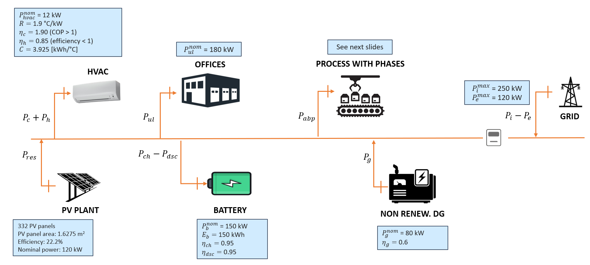

# Progetto del corso Smart Management of Renewable Energy System - A.A. 2024/2025
### Autori: Mattia Muraro, Mattia Castiello, Maria Chiara Ghinassi
___
Il progetto presentato in questa repository tratta la gestione di una microrete, in particolare di un distretto industriale. La microrete è mostrata nella figura che segue.

## Specifiche di controllo
### Obiettivi
- Minimizzazione dei costi o massimizzazione dei ricavi del distretto industriale;
- Mantenimento della temperatura intorno al set-point Tsp=22°C (da Aprile a Settembre), Tsp=20°C (da Ottobre a Marzo) con una tolleranza di $\Delta$=2°C;
- Mantenere lo stato di carica (SoC) della batteria nell'intervallo [0.1, 0.9];
- Garantire l'esecuzione del processo entro il tempo indicato dall'utente;

### Assunzioni
- Pc e Ph possono essere impostati nell'intervallo [0, $P^{nom}_{hvac}$];
- L'intervallo di campionamento $\Delta t_s$ = 1 h;
- $T(k), T_{ex}(k), P_{pv}(k), SoC(k), P_{ul}(𝑘)$ vengono misurati al tempo 𝑘;
- al tempo k vengono fornite le previsioni $T_{ex}, P_{pv}$ e $P_{ul}$ per le prossime 24 ore;
- il costo dell'energia importata $c_l(k)$ è noto per le prossime 24 ore (si usano i prezzi ARERA);
- il prezzo dell'energia esportata $p_e(k)$ è noto per le prossime 24 ore (si usa il PUN);
- il prezzo del carburante per il DG non rinnovabile $c_f$ è costante e noto.

I requisiti di tempo dell'utente sono dichiarati:
- per qualsiasi carico controllabile (ABP, HVAC), l'utente indica in anticipo l'intervallo di tempo entro il quale il carico può essere acceso impostando su 1 $UR_{hvac}(j), UR_{abp}(j)$ se il dispositivo può essere acceso all'ora j;
  * esempio: siamo al tempo 𝑘 e vogliamo che la lavatrice finisca tra 6 ore:  
      $$𝑈𝑅_{𝑎𝑏𝑝} (𝑗)=1 ∀𝑗=𝑘,𝑘+1,𝑘+6−1$$  
      $$𝑈𝑅_{𝑎𝑏𝑝} (𝑗)=0 ∀𝑗=𝑘+6,𝑘+7,…,𝑘+24−1$$
- per HVAC, l'utente dichiara il set point di temperatura $𝑇^{𝑠𝑝} (𝑗)$ per ogni intervallo di tempo nelle prossime 24 ore;
- per ABP, l'utente dichiara quale programma deve essere eseguito. In questo caso un programma univoco con i seguenti parametri:
  * energia richiesta per completare la fase i: $𝐸_{(𝑎𝑏𝑝,𝑖)}$=[11, 22, 31, 14]
  * tempo di esecuzione della fase 𝑖: $𝑇_{(𝑎𝑏𝑝,𝑖)}$=[2, 2, 2, 2]
  * potenza massima della fase 𝑖: $𝑃_{(𝑎𝑏𝑝,𝑖)}^{𝑚𝑎𝑥}$=[11, 22, 31, 14]
  * potenza minima della fase 𝑖: $𝑃_{(𝑎𝑏𝑝,𝑖)}^{𝑚𝑖𝑛}$=[0, 0, 0, 0]
  * ritardo massimo prima della fase 𝑖: $𝐷_𝑖$=[~, 2, 2, 2]

### Dataset
I dataset da utilizzare in questo progetto sono i seguenti:
- $T_{ex}$ : External temperature data  
  File name: T_ex_rome_campus_bio_medico_2022.mat  
  Variable name: T_ex  
  Format:[hour,forecasted temperature (°C), actual temperature (°C)]  
- $P_{pv}$ : da prevedere con il progetto di Deep Learning - Dataset-Project-Deep-Learning-SMRES.xls
- $P_{ul}$ : da prevedere con il progetto di Deep Learning - Dataset-Project-Deep-Learning-SMRES.xls
- $c_l$ : F1=0.53276 F2=0.54858 F3=0.46868 [€/kWh]
- $p_e$ : Prices data (PUN)  
  File name: PUN_2022.mat  
  Variable name: pun  
  Format: [price [€/MWh]]  
- $c_f$ : da testare con 0.45 e con 0.60 €/kWh

## Richieste
1. Realizzare il codice MATLAB/AMPL che resolve il problema proposto
2. Realizzare un elaborato (presentazione ppt oppure testo word) di una decina di slide o pagine con il seguente indice
    - Descrizione del caso studio
    - Formulazione del problema di ottimo
    - Risultati:
      * almeno la simulazione di 3 giorni (la scelta del mese quando identificabile è a piacere, meglio Maggio-Giugno per avere più sole);
      * analisi ulteriori (esempi seguono):
        - presenza o meno della batteria;
        - simulazioni di un periodi più lunghi (ad esempio 1 mese) con valutazioni economiche.  
